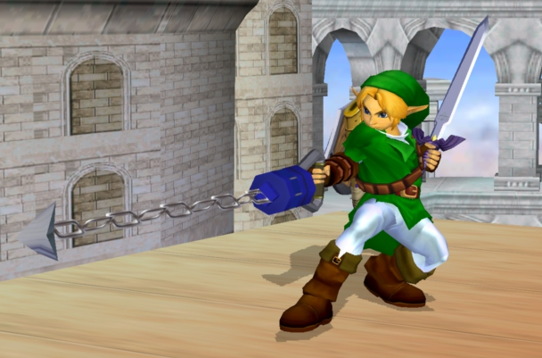

HOOKSHOT
========



This application relays information received from badgekit-api through webhooks to lumberyard, Webmaker's event aggregation queue.

## Run this app

```
cp .env-dist .env
npm install
node server
```
